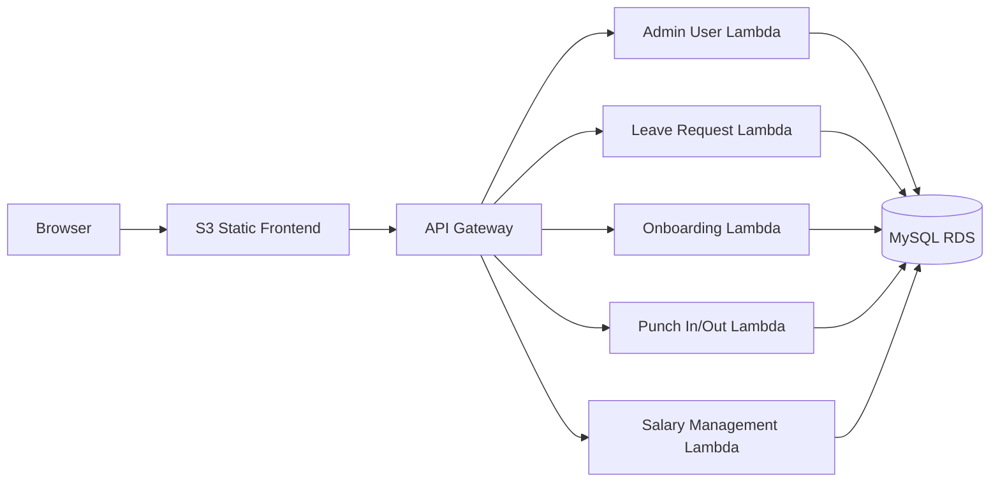

# HR Management Portal

A multi-service HR management platform built with a React frontend, AWS API Gateway, AWS Lambda, FastAPI, MySQL, and an S3 static website frontend.

## Problem Statement

HR teams usually work across disconnected tools for user management, leave approvals, onboarding, attendance, and payroll visibility. That creates duplicated data, manual reconciliation, and poor visibility into employee status.

This project solves that by centralizing core HR workflows into one portal with:
- admin user and permission management
- leave request tracking
- onboarding task tracking
- punch in / punch out and attendance views
- salary data views
- a public web frontend for easy access from anywhere

## Use Cases

### Admin use cases
- Create and manage users
- Assign permissions to employees
- View HR data across leave, onboarding, attendance, and salary modules
- Review demo data through the frontend explorers

### Employee use cases
- View their profile and status
- Browse leave request history
- Check onboarding progress
- Review attendance / punch in-out records
- See salary-related records

### HR operations use cases
- Seed and inspect sample employee data
- Validate service-specific database records
- Expose module-specific APIs behind a single public API Gateway

## What’s Included

- React + Vite frontend hosted on public S3 static website hosting
- Five AWS Lambda-backed backend services behind one API Gateway
- MySQL-based persistence in AWS RDS
- Live sample data for users, leave requests, onboarding, attendance, and salary records
- Admin demo switcher in the top bar
- Data explorer UI for the read-only service tables

## Live URLs

- Frontend: http://hr-management-portal-frontend-547485781687-ap-south-1.s3-website.ap-south-1.amazonaws.com
- API Gateway base URL: https://qihk58gv4g.execute-api.ap-south-1.amazonaws.com/prod

## Demo Accounts

The frontend supports two demo identities:

- Admin Demo: `admin@hr.local`
- Employee Demo: `hr.executive@hr.local`

These identities are used by the frontend to set the `X-Actor-Email` header for admin routes.

## Architecture



## Backend Services

| Service | Purpose | Key Routes |
|---|---|---|
| Admin User | User management and permissions | `/admin-user/health`, `/admin-user/users`, `/admin-user/permissions` |
| Leave Requests | Leave request explorer | `/leave-requests/health`, `/leave-requests/db/tables`, `/leave-requests/db/query` |
| Onboarding | Onboarding explorer | `/onboarding/health`, `/onboarding/db/tables`, `/onboarding/db/query` |
| Punch In/Out | Attendance explorer | `/punch-in-out/health`, `/punch-in-out/db/tables`, `/punch-in-out/db/query` |
| Salary Management | Salary explorer | `/salary-management/health`, `/salary-management/db/tables`, `/salary-management/db/query` |

## Project Structure

- [backend/](backend/) - FastAPI microservices, AWS SAM template, database seed scripts
- [frontend/](frontend/) - React app, UI components, API client, S3 deploy script
- [AWS_ENDPOINTS.md](AWS_ENDPOINTS.md) - Public API endpoint reference
- [DEPLOY.md](DEPLOY.md) - Deployment guide
- [flow.md](flow.md) - Original workflow notes and design context

## Frontend Features

- Demo account switcher in the top bar
- Dashboard with HR module overview
- Admin users page
- Admin permissions page
- My profile page
- Data explorer pages for leave, onboarding, attendance, and salary modules
- S3-hosted public static website deployment

## Backend Features

- FastAPI app per service
- AWS Lambda handler for each service
- API Gateway routing under one shared HTTP API stage
- MySQL RDS backed data access
- Read-only database query endpoints for non-admin modules
- Admin-only create and permission actions for the admin service

## Seeded Demo Data

The database includes sample rows for:
- multiple users
- leave requests
- onboarding tasks
- attendance / punch in-out records
- salary records

The demo data is designed so the frontend explorers show real tables and records instead of empty states.

## Local Development

### Backend

Each backend service can run independently.

```bash
cd backend/admin_user
pip install -r requirements.txt
uvicorn app.main:app --reload --port 8001
```

Other services follow the same pattern inside their own folders.

### Frontend

```bash
cd frontend
npm install
npm run dev
```

Set the API base URL in `frontend/.env` if needed:

```bash
VITE_API_BASE_URL=https://qihk58gv4g.execute-api.ap-south-1.amazonaws.com/prod
```

## AWS Deployment

### Backend

The backend is deployed with AWS SAM.

```bash
cd backend
sam build
sam deploy --guided
```

### Frontend

The frontend is deployed to S3 using the helper script.

```bash
cd frontend
./scripts/deploy-s3-static.sh
```

This script:
- builds the Vite app
- uploads `dist/` to a public S3 bucket
- enables static website hosting
- sets a public read bucket policy

## Important Notes

- The frontend uses `VITE_API_BASE_URL` when present, otherwise it falls back to the live API Gateway URL.
- Admin actions require the `X-Actor-Email` header.
- The public DB explorer endpoints are read-only.
- The project uses one Lambda per backend feature service.
- The repo contains both the source app and deployment artifacts created during AWS packaging; the root `.gitignore` filters out the usual generated files and local environment folders.

## API Reference

See [AWS_ENDPOINTS.md](AWS_ENDPOINTS.md) for the current live endpoints and quick test commands.

See [backend/README.md](backend/README.md) for backend-specific service documentation.

## Current Status

- Backend deployed to AWS Lambda and API Gateway
- Frontend deployed to public S3 static website hosting
- Demo data seeded into the MySQL database
- Admin demo and employee demo accounts aligned with the seeded backend users

## Troubleshooting

- If the frontend shows a network error, verify the browser is using the live S3 site and not a stale cached bundle.
- If admin actions return 401, make sure the admin demo account is selected in the top bar.
- If database explorer pages show no data, confirm the seed script ran against the live RDS instance.

## Related Documentation

- [backend/README.md](backend/README.md)
- [frontend/README.md](frontend/README.md)
- [DEPLOY.md](DEPLOY.md)
- [AWS_ENDPOINTS.md](AWS_ENDPOINTS.md)
