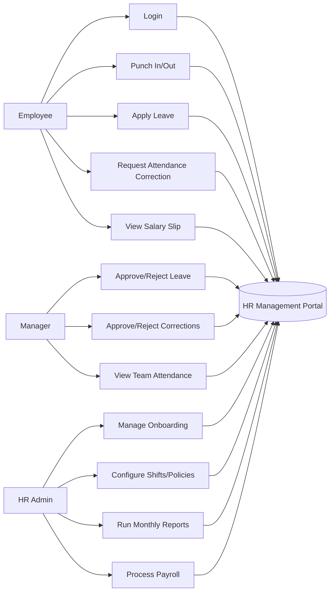
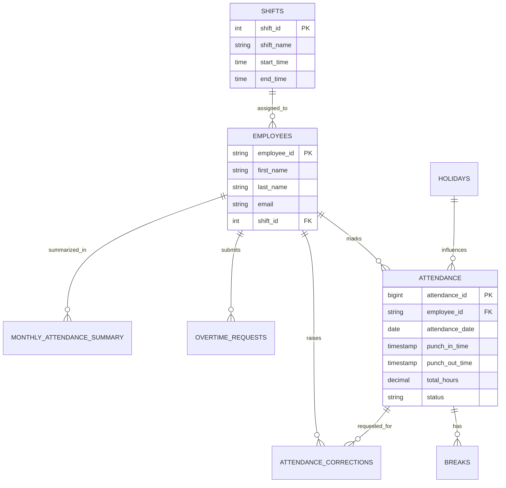
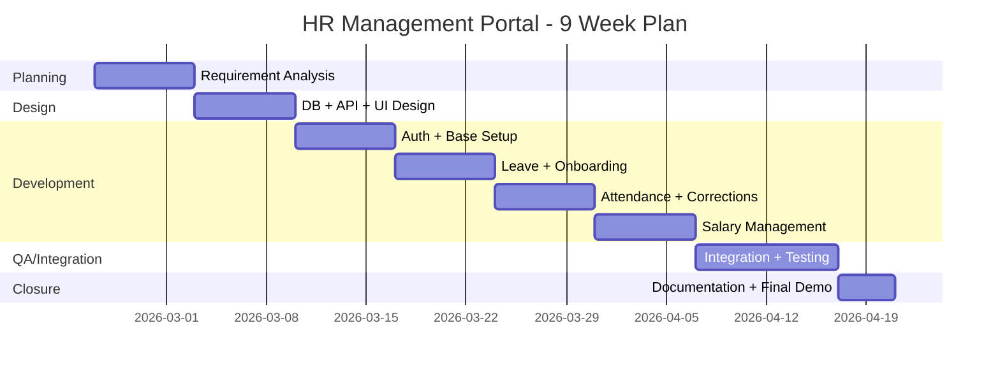
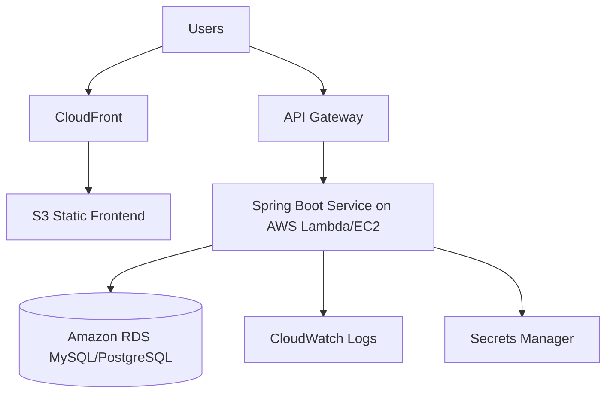

# HR Management Portal – Project Proposal

## 1) Detailed Description of the Project

### 1.1 Project Title
**HR Management Portal**

### 1.2 Project Abstract
The HR Management Portal is a web-based enterprise application designed to automate and centralize core HR operations. The system consists of modular services for Leave Request Submission, Employee Onboarding, Punch In/Out Attendance Tracking, and Salary Management, with a unified frontend for employees, managers, and HR administrators.

The goal is to reduce manual processing, improve data accuracy, ensure policy compliance, and provide actionable HR insights through reports and dashboards.

### 1.3 Problem Statement
Many organizations still rely on spreadsheets, emails, and manual approvals for HR operations, causing:
- Delayed approvals and poor visibility
- Data inconsistency across departments
- Attendance and payroll disputes
- Lack of audit trails and compliance evidence

### 1.4 Proposed Solution
The proposed portal provides role-based access and module-wise automation:
- **Leave Module**: Apply, review, approve/reject leave with policy checks
- **Onboarding Module**: Track candidate-to-employee onboarding steps and documents
- **Punch In/Out Module**: Capture attendance, breaks, overtime, corrections, and reports
- **Salary Module**: Manage salary structures, payslip generation, and payroll records

### 1.5 Core Features
- JWT-based authentication and role-based authorization
- Attendance with shift, grace period, and overtime handling
- Leave lifecycle management with manager approvals
- Employee onboarding checklist/workflow tracking
- Monthly summaries and department-level reports
- Audit logs for accountability and compliance

### 1.6 Expected Outcomes
- Faster HR operations and reduced paperwork
- Improved attendance/payroll accuracy
- Transparent approval workflows
- Better decision-making using HR analytics

---

## 2) Study of Literature Survey

### 2.1 Domain Review
The project studies HRMS and Workforce Management systems commonly used in SMEs and enterprises. Key focus areas include:
- Time & Attendance tracking models
- Leave policy automation
- Role-based approval workflows
- Payroll data integration with attendance and overtime

### 2.2 Reference Areas Studied
- Kavanagh and Johnson (2017) stated that HRMS is an integrated system used to collect, store, and manage employee information. Their study concluded that HRMS improves efficiency, reduces paperwork, and supports better organizational decision-making.

- Gary Dessler (2017) explained that HRMS helps manage core HR functions such as recruitment, payroll, performance evaluation, and employee records. He emphasized that HRMS reduces administrative workload and improves HR productivity.

- Michael Armstrong (2014) highlighted that HRMS improves organizational performance by maintaining accurate employee data and supporting performance monitoring and employee development.

- Navaz et al. (2013) developed a computerized HRMS and found that it improves data accuracy, reduces manual work, and enhances HR operational efficiency.

- Beadles et al. (2005) studied the impact of HRMS on organizations and concluded that HRMS reduces operational costs, improves efficiency, and enhances employee management.

- Hendrickson (2003) stated that HRMS improves workforce planning and employee data management by providing accurate and timely information.

- Troshani et al. (2011) found that HRMS improves communication, information accessibility, and HR decision-making in organizations.

- Parry and Tyson (2011) concluded that HRMS improves recruitment, performance management, and employee engagement through automation and digital technology.

### 2.3 Limitations of existing systems
Although HRMS provides many benefits, previous studies have identified some limitations:

- Some systems are complex and difficult to use.
- Traditional systems lack user-friendly interfaces.
- Limited accessibility and integration with modern technologies.
- Some systems do not provide real-time data updates.
- High implementation and maintenance cost in some cases.

### 2.4 Gap Identified

From the literature survey, it is observed that HRMS improves efficiency, reduces manual work, and enhances decision-making. However, some existing systems lack user-friendly design, real-time access, and modern features. Therefore, there is a need to develop an improved HRMS that provides better usability, efficient data management, and enhanced performance.


---

## 3) Feasibility Analysis

### 3.1 Technical Feasibility
- **Backend**: Java 17, Spring Boot, Maven
- **Database**: MySQL/PostgreSQL
- **Frontend**: Web UI (module-based)
- **Deployment readiness**: Cloud-compatible architecture (including serverless support)

**Conclusion**: Technically feasible with current team skillset and available open-source ecosystem.

### 3.2 Operational Feasibility
- Roles and workflows align with real HR operational processes
- UI can be adopted by employees, managers, and HR with minimal training
- Automation reduces repetitive manual tasks

**Conclusion**: Operationally feasible and useful in day-to-day HR execution.

### 3.3 Economic Feasibility
- Uses open-source frameworks, reducing licensing costs
- Lower operational effort and fewer manual errors save recurring cost
- Scalable architecture avoids expensive rework in future

**Conclusion**: Economically viable for pilot and long-term production.

### 3.4 Schedule Feasibility
- Work is split into independent modules that can be developed in parallel
- MVP can be delivered in phases with progressive enhancement

**Conclusion**: Achievable within academic project timelines.

---

## 4) Project Roadmap

### Phase 1: Requirement Analysis & Planning (Week 1)
- Finalize scope, user roles, functional requirements, and business rules
- Define acceptance criteria and module boundaries

### Phase 2: System Design (Week 2)
- Database schema design
- API contract definition
- UI wireframes for major flows

### Phase 3: Core Development (Weeks 3–6)
- Implement authentication and common services
- Develop Leave and Onboarding modules
- Develop Attendance (Punch In/Out, Breaks, Corrections, Overtime)
- Develop Salary management basics

### Phase 4: Integration & Testing (Weeks 7–8)
- Module integration and end-to-end flow validation
- Unit testing, integration testing, and bug fixes
- Performance tuning for reports and queries

### Phase 5: Documentation & Final Review (Week 9)
- Prepare technical documentation and user guide
- Demo preparation and final submission package

---

## 5) Distribution of Work Among Team Members

| Team Member | Role | Key Responsibilities | Deliverables |
|---|---|---|---|
| Siddharth Singh | Project Lead / Backend Coordinator | Architecture decisions, API standards, integration oversight | Architecture doc, integrated backend services |
| Nice | Attendance Module Developer | Punch In/Out, break tracking, corrections, overtime, reports | Attendance APIs, business rules, test cases |
| Om Mishra | Leave & Onboarding Developer | Leave workflows, onboarding tracking, policy validations | Leave/Onboarding APIs, workflow documentation |
| Priyanka | Frontend & UX Developer + QA & Documentation | Dashboard and module interfaces, form validations, role-based views, test planning, defect tracking, and final documentation | UI screens, frontend integration, test report, user manual, proposal/final report |

> Note: Add registration numbers next to names in the final print copy.

---

## 6) Other Relevant Factors

### 6.1 Required Resources
- Development machines (Java + Node environment)
- Database server (MySQL/PostgreSQL)
- Version control repository (Git)
- API testing and collaboration tools

### 6.2 Proposed Timeline Snapshot
- Planning & analysis: 1 week
- Design: 1 week
- Development: 4 weeks
- Testing & integration: 2 weeks
- Finalization: 1 week

Total duration: **~9 weeks**

### 6.3 Risk Analysis and Mitigation

| Risk | Impact | Mitigation Strategy |
|---|---|---|
| Requirement changes mid-development | Scope creep, delays | Freeze MVP scope early, track changes via change log |
| Integration conflicts across modules | Rework and instability | Shared API contracts, frequent integration checks |
| Data inconsistency in HR records | Incorrect reports/payroll | Strong validation rules, relational constraints, audit logs |
| Security vulnerabilities | Data exposure risk | JWT auth, role checks, secure config, logging & monitoring |
| Time constraints before submission | Incomplete deliverables | Weekly milestones, priority-based backlog, parallel development |

### 6.4 Quality and Compliance Considerations
- Role-based access control for sensitive HR operations
- Audit trail for approvals and modifications
- Backup and recovery planning for attendance/payroll data
- Structured testing before final release

### 6.5 Deployment Strategy (AWS)
- **Hosting**: AWS (Spring Boot services deployed via AWS Lambda or EC2/ECS as per module needs)
- **Database**: Amazon RDS (MySQL/PostgreSQL)
- **API Layer**: Amazon API Gateway
- **Authentication/Secrets**: AWS Secrets Manager + IAM role-based access
- **Storage/Logs**: Amazon S3 for artifacts and CloudWatch for logs/monitoring
- **CI/CD**: Git-based pipeline with build, test, and deploy stages

**Deployment Outcome**: Scalable, secure, and production-ready cloud deployment aligned with enterprise practices.

---

## 7) Conclusion
The HR Management Portal is a practical, scalable, and high-impact project addressing real organizational HR challenges. With modular design, role-based workflows, and strong data management, the solution is suitable for both academic evaluation and future production extension.

---

## 8) Annexure (Optional for Hard Copy)

### 8.1 Use Case Diagrams



### 8.2 ER Diagram and Schema Snapshot



**Schema Snapshot (Key Tables)**
- `employees(employee_id, first_name, last_name, email, shift_id, manager_id, is_active)`
- `shifts(shift_id, shift_name, start_time, end_time, grace_period_minutes, full_day_hours)`
- `attendance(attendance_id, employee_id, attendance_date, punch_in_time, punch_out_time, total_hours, overtime_hours, status)`
- `breaks(break_id, attendance_id, break_start_time, break_end_time, duration_minutes)`
- `attendance_corrections(correction_id, attendance_id, employee_id, requested_punch_in, requested_punch_out, reason, status)`
- `monthly_attendance_summary(summary_id, employee_id, year, month, present_days, absent_days, total_hours_worked)`

### 8.3 API List and Sample Requests/Responses

**Core APIs**
- `POST /api/auth/login`
- `POST /api/attendance/punch-in`
- `POST /api/attendance/punch-out`
- `GET /api/attendance/status?employeeId=EMP001`
- `POST /api/corrections/request`
- `PUT /api/corrections/{correctionId}/approve`
- `GET /api/reports/employee/{employeeId}/summary/{year}/{month}`

**Sample 1: Punch In**

Request:
```http
POST /api/attendance/punch-in
Content-Type: application/json
Authorization: Bearer <jwt-token>

{
	"employeeId": "EMP001",
	"punchInTime": "2026-02-24T09:10:00",
	"location": "Head Office",
	"device": "Web"
}
```

Response:
```json
{
	"success": true,
	"message": "Punch in recorded successfully",
	"attendanceId": 12045,
	"status": "PRESENT"
}
```

**Sample 2: Attendance Status**

Request:
```http
GET /api/attendance/status?employeeId=EMP001
Authorization: Bearer <jwt-token>
```

Response:
```json
{
	"employeeId": "EMP001",
	"attendanceDate": "2026-02-24",
	"punchedIn": true,
	"punchedOut": false,
	"punchInTime": "2026-02-24T09:10:00",
	"currentStatus": "WORKING"
}
```

### 8.4 Test Cases and Sample Outputs

| Test ID | Module | Test Scenario | Input | Expected Output | Sample Result |
|---|---|---|---|---|---|
| TC-01 | Auth | Valid login | Valid credentials | JWT token generated | Pass |
| TC-02 | Attendance | Punch in once per day | EMP001 punch-in request | Attendance record created | Pass |
| TC-03 | Attendance | Duplicate punch-in prevention | Second punch-in same day | Validation error message | Pass |
| TC-04 | Breaks | Break start/end calculation | Break start + end | Duration stored in minutes | Pass |
| TC-05 | Corrections | Request correction within 7 days | Correction payload | Status set to PENDING | Pass |
| TC-06 | Manager Flow | Approve correction | Approve API call | Attendance updated, status APPROVED | Pass |
| TC-07 | Reports | Monthly summary generation | Employee + month | Present/Absent/Hours summary | Pass |
| TC-08 | Security | API without token | No auth header | 401 Unauthorized | Pass |

**Sample Test Output (Illustrative)**
```text
[INFO] Running AttendanceServiceTest
[INFO] Tests run: 12, Failures: 0, Errors: 0, Skipped: 0
[INFO] Running CorrectionServiceTest
[INFO] Tests run: 8, Failures: 0, Errors: 0, Skipped: 0
[INFO] BUILD SUCCESS
```

### 8.5 Gantt Chart for Schedule Tracking



### 8.6 AWS Deployment Architecture Snapshot



**Environment (AWS) – Proposed**
- `DB_HOST=<rds-endpoint>`
- `DB_PORT=3306`
- `DB_NAME=hr_management`
- `JWT_SECRET=<stored-in-secrets-manager>`
- `AWS_REGION=ap-south-1`
