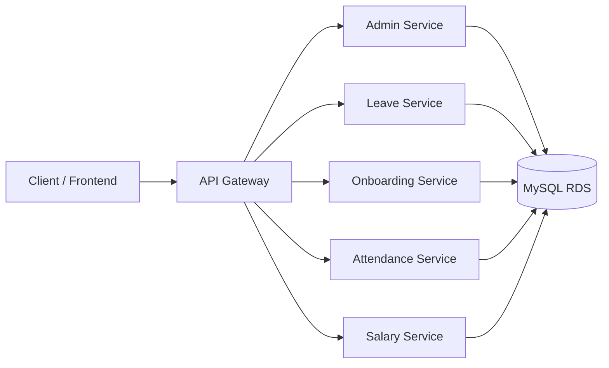
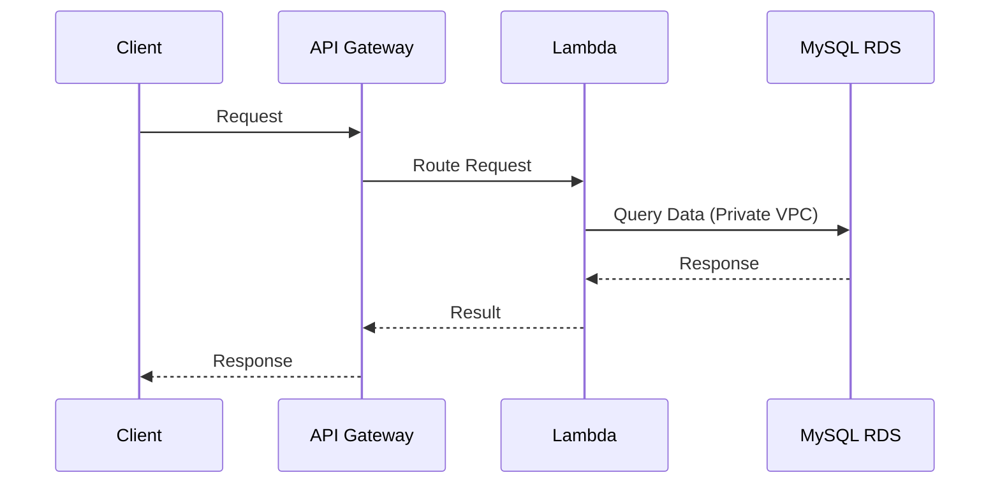

# 🚀 HR Management 

A scalable and secure **HR Management Backend System** built using **FastAPI microservices**, deployed on **AWS Lambda**, connected via **API Gateway**, and secured using **VPC with MySQL RDS**.

---

## 📌 Overview

This system follows a **microservices architecture** where each HR functionality (attendance, leave, onboarding, salary, admin) is implemented as an independent service.

Each service:

* Runs as a separate AWS Lambda function
* Exposes its own APIs
* Connects to a shared MySQL database
* Is accessible via a unified API Gateway

---

## 🏗️ System Architecture



---

## 🔐 Cloud Architecture & Security

### 🛡️ Secure Deployment Design

* All services are deployed as **AWS Lambda functions**
* All Lambda functions are inside a **VPC**
* The database (**MySQL RDS**) is also inside the same VPC
* The database is **not publicly accessible**
* Access is controlled via **Security Groups**

---

### 🔒 Secure Data Flow



---

## 🧩 Microservices

| Service                | Description             |
| ---------------------- | ----------------------- |
| `admin_user`           | Admin & user management |
| `leave_req_submission` | Leave management        |
| `onbording`            | Employee onboarding     |
| `punch_in_out`         | Attendance tracking     |
| `salary_management`    | Salary & payroll        |

---

## ☁️ AWS Deployment

### Lambda Functions

| Function Name           | Service       |
| ----------------------- | ------------- |
| hr-admin-user           | admin_user    |
| hr-leave-req-submission | leave service |
| hr-onboarding           | onboarding    |
| hr-punch-in-out         | attendance    |
| hr-salary-management    | salary        |

### Handler (Common)

```
app.lambda_handler.handler
```

---

## 🌐 API Gateway

* **Region:** ap-south-1
* **Base URL:**

```
https://rkskrnxx50.execute-api.ap-south-1.amazonaws.com
```

---

### API Base Paths

| Service    | Path               |
| ---------- | ------------------ |
| Admin      | /admin-user        |
| Leave      | /leave-requests    |
| Onboarding | /onboarding        |
| Attendance | /punch-in-out      |
| Salary     | /salary-management |

---

## 🔌 API Documentation

### 🔐 Admin APIs

**Header Required:**

```
X-Actor-Email: admin@hr.local
```

| Method | Endpoint                           | Description        |
| ------ | ---------------------------------- | ------------------ |
| GET    | /admin-user/health                 | Health check       |
| GET    | /admin-user/users                  | Get users          |
| POST   | /admin-user/users                  | Create user        |
| POST   | /admin-user/users/{id}/permissions | Assign permissions |
| GET    | /admin-user/users/me               | Current user       |
| GET    | /admin-user/permissions            | List permissions   |
| POST   | /admin-user/permissions            | Create permission  |

---

## 🗄️ Database Query APIs

Available in:

* leave-requests
* onboarding
* punch-in-out
* salary-management

---

### Endpoints

```
GET /{service}/db/health
GET /{service}/db/tables
GET /{service}/db/query
GET /{service}/db/query/{table}/{id}
```

---

### Query Parameters

| Parameter | Description         |
| --------- | ------------------- |
| table     | Required table name |
| limit     | Default 50          |
| offset    | Pagination          |
| order_by  | Sort column         |
| order_dir | asc / desc          |
| filters   | column:value        |

---

## 🔍 API Examples

### List Tables

```bash
curl "$API_BASE/leave-requests/db/tables"
```

### Query Data

```bash
curl "$API_BASE/leave-requests/db/query?table=users&limit=10"
```

### Filter Data

```bash
curl "$API_BASE/punch-in-out/db/query?table=users&filters=is_admin:1"
```

---

## 🛢️ Database Configuration

All services share a **common environment file**:

### `.env`

```
MYSQL_HOST
MYSQL_PORT
MYSQL_USER
MYSQL_PASSWORD
MYSQL_DATABASE
AUTO_CREATE_TABLES
ADMIN_BOOTSTRAP_EMAIL
ADMIN_BOOTSTRAP_PASSWORD
```

---

## 🔁 How System Works with Database

### Flow

```
Client → API Gateway → Lambda → MySQL RDS → Response
```

---

### Example (Query Execution)

1. Request:

```
GET /punch-in-out/db/query?table=attendance
```

2. Lambda Service:

* Validates input
* Builds SQL query

3. Database:

```sql
SELECT * FROM attendance LIMIT 50;
```

4. Response returned to client

---

## ⚙️ Local Development

```bash
cd backend/admin_user
pip install -r requirements.txt
uvicorn app.main:app --reload --port 8001
```

---

## 🌱 Database Seeding

### Python

```bash
python scripts/seed_admin_users.py
```

### SQL

```bash
mysql -h <host> -u admin -p < scripts/seed_admin_users.sql
```

---

## 🚀 Deployment (AWS SAM)

```bash
cd backend
sam build
sam deploy --guided
```

---

## 🔐 Security Features

* VPC-based isolation
* No public DB access
* Security group restrictions
* Read-only query APIs
* Sensitive data masking

---

## 🧠 Key Concepts

* Microservices architecture
* Serverless computing (AWS Lambda)
* API Gateway routing
* Shared database system
* Secure VPC networking

---

## 📊 Health Check

```bash
curl "$API_BASE/admin-user/health"
curl "$API_BASE/leave-requests/health"
curl "$API_BASE/onboarding/health"
curl "$API_BASE/punch-in-out/health"
curl "$API_BASE/salary-management/health"
```

---

## 📈 Future Enhancements

* Full authentication system
* Role-based access control
* Logging & monitoring
* Rate limiting

