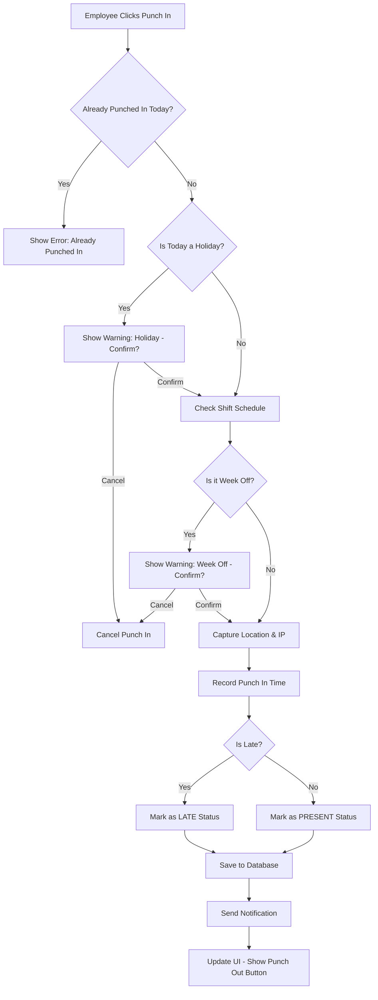
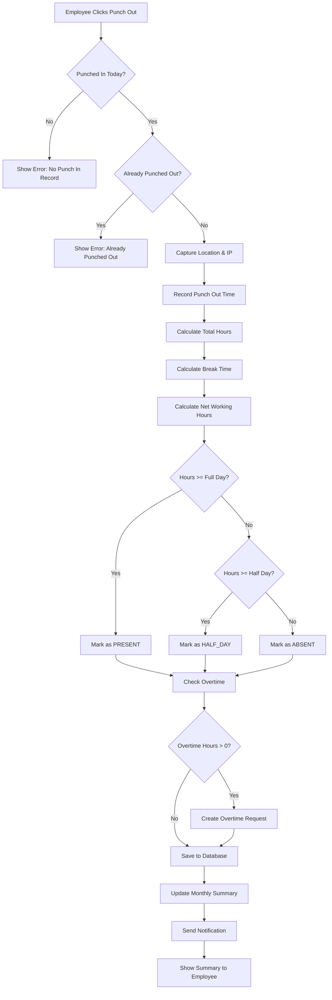
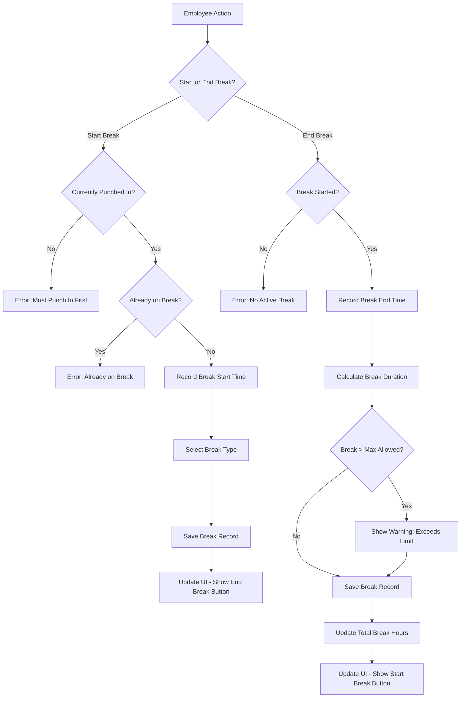
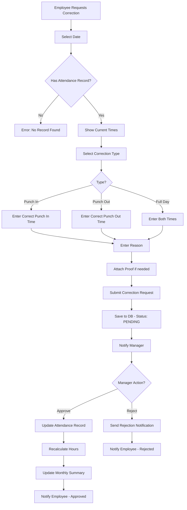
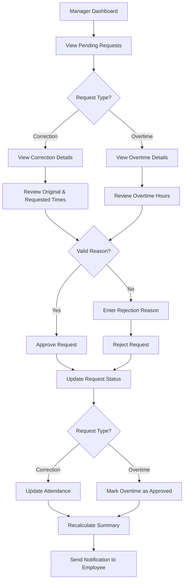
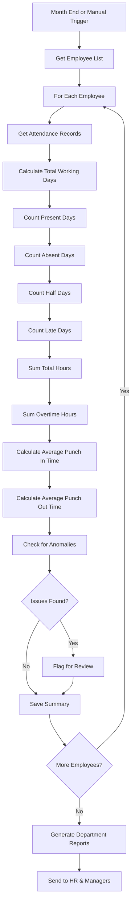
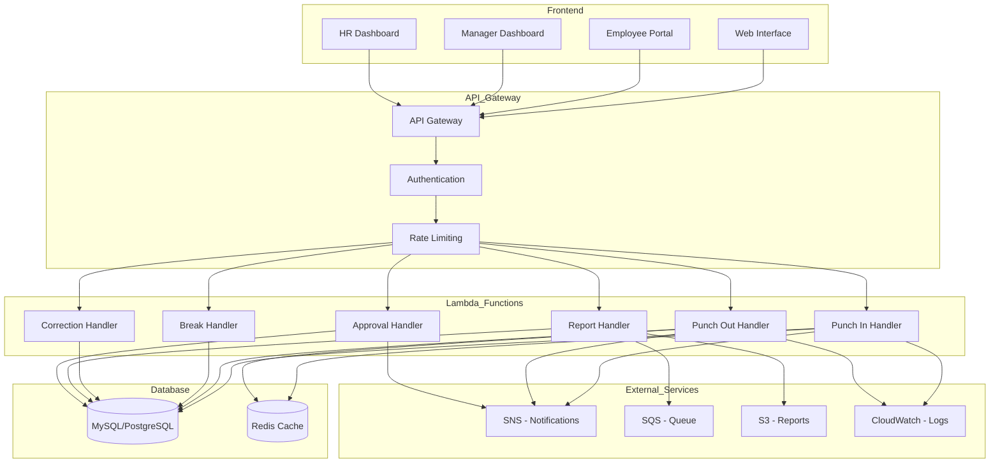

# Punch In/Out Time Tracking Module

## 🎯 Overview
This module handles employee attendance tracking with punch-in/punch-out functionality, overtime calculation, shift management, and comprehensive reporting.

## 🗄️ Database Schema

### Tables Structure

#### 1. **employees** (Master Table)
```sql
CREATE TABLE employees (
    employee_id VARCHAR(50) PRIMARY KEY,
    first_name VARCHAR(100) NOT NULL,
    last_name VARCHAR(100) NOT NULL,
    email VARCHAR(255) UNIQUE NOT NULL,
    department VARCHAR(100),
    designation VARCHAR(100),
    shift_id INT,
    manager_id VARCHAR(50),
    is_active BOOLEAN DEFAULT TRUE,
    created_at TIMESTAMP DEFAULT CURRENT_TIMESTAMP,
    updated_at TIMESTAMP DEFAULT CURRENT_TIMESTAMP ON UPDATE CURRENT_TIMESTAMP,
    FOREIGN KEY (shift_id) REFERENCES shifts(shift_id),
    FOREIGN KEY (manager_id) REFERENCES employees(employee_id)
);
```

#### 2. **shifts** (Shift Configuration)
```sql
CREATE TABLE shifts (
    shift_id INT PRIMARY KEY AUTO_INCREMENT,
    shift_name VARCHAR(50) NOT NULL,
    start_time TIME NOT NULL,
    end_time TIME NOT NULL,
    grace_period_minutes INT DEFAULT 15,
    half_day_hours DECIMAL(4,2) DEFAULT 4.00,
    full_day_hours DECIMAL(4,2) DEFAULT 8.00,
    overtime_threshold_minutes INT DEFAULT 30,
    is_active BOOLEAN DEFAULT TRUE,
    created_at TIMESTAMP DEFAULT CURRENT_TIMESTAMP
);
```

#### 3. **attendance** (Daily Punch Records)
```sql
CREATE TABLE attendance (
    attendance_id BIGINT PRIMARY KEY AUTO_INCREMENT,
    employee_id VARCHAR(50) NOT NULL,
    attendance_date DATE NOT NULL,
    punch_in_time TIMESTAMP,
    punch_in_location VARCHAR(255),
    punch_in_ip VARCHAR(45),
    punch_in_device VARCHAR(100),
    punch_out_time TIMESTAMP,
    punch_out_location VARCHAR(255),
    punch_out_ip VARCHAR(45),
    punch_out_device VARCHAR(100),
    total_hours DECIMAL(5,2),
    overtime_hours DECIMAL(5,2) DEFAULT 0,
    break_hours DECIMAL(5,2) DEFAULT 0,
    status ENUM('PRESENT', 'ABSENT', 'HALF_DAY', 'LATE', 'ON_LEAVE', 'HOLIDAY', 'WEEK_OFF') DEFAULT 'PRESENT',
    is_overtime_approved BOOLEAN DEFAULT FALSE,
    remarks TEXT,
    created_at TIMESTAMP DEFAULT CURRENT_TIMESTAMP,
    updated_at TIMESTAMP DEFAULT CURRENT_TIMESTAMP ON UPDATE CURRENT_TIMESTAMP,
    FOREIGN KEY (employee_id) REFERENCES employees(employee_id),
    UNIQUE KEY unique_attendance (employee_id, attendance_date),
    INDEX idx_emp_date (employee_id, attendance_date),
    INDEX idx_date (attendance_date)
);
```

#### 4. **breaks** (Break Time Tracking)
```sql
CREATE TABLE breaks (
    break_id BIGINT PRIMARY KEY AUTO_INCREMENT,
    attendance_id BIGINT NOT NULL,
    break_start_time TIMESTAMP NOT NULL,
    break_end_time TIMESTAMP,
    break_type ENUM('LUNCH', 'TEA', 'PERSONAL', 'OTHER') DEFAULT 'LUNCH',
    duration_minutes INT,
    remarks VARCHAR(255),
    created_at TIMESTAMP DEFAULT CURRENT_TIMESTAMP,
    FOREIGN KEY (attendance_id) REFERENCES attendance(attendance_id) ON DELETE CASCADE,
    INDEX idx_attendance (attendance_id)
);
```

#### 5. **attendance_corrections** (Edit Requests)
```sql
CREATE TABLE attendance_corrections (
    correction_id BIGINT PRIMARY KEY AUTO_INCREMENT,
    attendance_id BIGINT NOT NULL,
    employee_id VARCHAR(50) NOT NULL,
    correction_type ENUM('PUNCH_IN', 'PUNCH_OUT', 'BREAK', 'FULL_DAY') NOT NULL,
    original_punch_in TIMESTAMP,
    original_punch_out TIMESTAMP,
    requested_punch_in TIMESTAMP,
    requested_punch_out TIMESTAMP,
    reason TEXT NOT NULL,
    status ENUM('PENDING', 'APPROVED', 'REJECTED') DEFAULT 'PENDING',
    approved_by VARCHAR(50),
    approved_at TIMESTAMP,
    rejection_reason TEXT,
    created_at TIMESTAMP DEFAULT CURRENT_TIMESTAMP,
    updated_at TIMESTAMP DEFAULT CURRENT_TIMESTAMP ON UPDATE CURRENT_TIMESTAMP,
    FOREIGN KEY (attendance_id) REFERENCES attendance(attendance_id),
    FOREIGN KEY (employee_id) REFERENCES employees(employee_id),
    FOREIGN KEY (approved_by) REFERENCES employees(employee_id),
    INDEX idx_employee (employee_id),
    INDEX idx_status (status)
);
```

#### 6. **holidays** (Holiday Calendar)
```sql
CREATE TABLE holidays (
    holiday_id INT PRIMARY KEY AUTO_INCREMENT,
    holiday_date DATE NOT NULL UNIQUE,
    holiday_name VARCHAR(255) NOT NULL,
    holiday_type ENUM('NATIONAL', 'FESTIVAL', 'OPTIONAL', 'COMPANY') DEFAULT 'NATIONAL',
    is_mandatory BOOLEAN DEFAULT TRUE,
    description TEXT,
    created_at TIMESTAMP DEFAULT CURRENT_TIMESTAMP
);
```

#### 7. **weekly_offs** (Week Off Configuration)
```sql
CREATE TABLE weekly_offs (
    weekly_off_id INT PRIMARY KEY AUTO_INCREMENT,
    employee_id VARCHAR(50),
    shift_id INT,
    day_of_week ENUM('MONDAY', 'TUESDAY', 'WEDNESDAY', 'THURSDAY', 'FRIDAY', 'SATURDAY', 'SUNDAY') NOT NULL,
    is_active BOOLEAN DEFAULT TRUE,
    effective_from DATE NOT NULL,
    effective_to DATE,
    FOREIGN KEY (employee_id) REFERENCES employees(employee_id),
    FOREIGN KEY (shift_id) REFERENCES shifts(shift_id),
    INDEX idx_employee (employee_id),
    INDEX idx_shift (shift_id)
);
```

#### 8. **monthly_attendance_summary** (Monthly Reports)
```sql
CREATE TABLE monthly_attendance_summary (
    summary_id BIGINT PRIMARY KEY AUTO_INCREMENT,
    employee_id VARCHAR(50) NOT NULL,
    year INT NOT NULL,
    month INT NOT NULL,
    total_working_days INT DEFAULT 0,
    present_days INT DEFAULT 0,
    absent_days INT DEFAULT 0,
    half_days INT DEFAULT 0,
    late_days INT DEFAULT 0,
    leaves_taken INT DEFAULT 0,
    total_hours_worked DECIMAL(8,2) DEFAULT 0,
    total_overtime_hours DECIMAL(8,2) DEFAULT 0,
    average_punch_in_time TIME,
    average_punch_out_time TIME,
    created_at TIMESTAMP DEFAULT CURRENT_TIMESTAMP,
    updated_at TIMESTAMP DEFAULT CURRENT_TIMESTAMP ON UPDATE CURRENT_TIMESTAMP,
    FOREIGN KEY (employee_id) REFERENCES employees(employee_id),
    UNIQUE KEY unique_month_summary (employee_id, year, month),
    INDEX idx_year_month (year, month)
);
```

#### 9. **overtime_requests** (Overtime Approval)
```sql
CREATE TABLE overtime_requests (
    overtime_id BIGINT PRIMARY KEY AUTO_INCREMENT,
    attendance_id BIGINT NOT NULL,
    employee_id VARCHAR(50) NOT NULL,
    overtime_date DATE NOT NULL,
    requested_hours DECIMAL(5,2) NOT NULL,
    reason TEXT NOT NULL,
    status ENUM('PENDING', 'APPROVED', 'REJECTED') DEFAULT 'PENDING',
    approved_by VARCHAR(50),
    approved_at TIMESTAMP,
    rejection_reason TEXT,
    created_at TIMESTAMP DEFAULT CURRENT_TIMESTAMP,
    updated_at TIMESTAMP DEFAULT CURRENT_TIMESTAMP ON UPDATE CURRENT_TIMESTAMP,
    FOREIGN KEY (attendance_id) REFERENCES attendance(attendance_id),
    FOREIGN KEY (employee_id) REFERENCES employees(employee_id),
    FOREIGN KEY (approved_by) REFERENCES employees(employee_id),
    INDEX idx_employee (employee_id),
    INDEX idx_status (status)
);
```

#### 10. **audit_logs** (Activity Tracking)
```sql
CREATE TABLE audit_logs (
    log_id BIGINT PRIMARY KEY AUTO_INCREMENT,
    employee_id VARCHAR(50),
    action_type VARCHAR(100) NOT NULL,
    entity_type VARCHAR(50) NOT NULL,
    entity_id VARCHAR(100),
    old_value TEXT,
    new_value TEXT,
    ip_address VARCHAR(45),
    user_agent VARCHAR(255),
    created_at TIMESTAMP DEFAULT CURRENT_TIMESTAMP,
    FOREIGN KEY (employee_id) REFERENCES employees(employee_id),
    INDEX idx_employee (employee_id),
    INDEX idx_entity (entity_type, entity_id),
    INDEX idx_created (created_at)
);
```

---

## 🔄 Flow Diagrams

### 1. Punch In Flow


### 2. Punch Out Flow


### 3. Break Management Flow


### 4. Attendance Correction Flow


### 5. Manager Approval Flow


### 6. Monthly Report Generation Flow


### 7. Complete System Architecture


---

## 🔌 API Endpoints

### Authentication
```
POST   /api/auth/login
POST   /api/auth/logout
GET    /api/auth/profile
```

### Punch Operations
```
POST   /api/attendance/punch-in
POST   /api/attendance/punch-out
GET    /api/attendance/status
GET    /api/attendance/today
```

### Break Management
```
POST   /api/attendance/break/start
POST   /api/attendance/break/end
GET    /api/attendance/breaks/{attendanceId}
```

### Attendance Records
```
GET    /api/attendance/employee/{employeeId}
GET    /api/attendance/employee/{employeeId}/month/{year}/{month}
GET    /api/attendance/date/{date}
GET    /api/attendance/{attendanceId}
```

### Corrections
```
POST   /api/corrections/request
GET    /api/corrections/employee/{employeeId}
GET    /api/corrections/pending
PUT    /api/corrections/{correctionId}/approve
PUT    /api/corrections/{correctionId}/reject
```

### Overtime
```
POST   /api/overtime/request
GET    /api/overtime/employee/{employeeId}
GET    /api/overtime/pending
PUT    /api/overtime/{overtimeId}/approve
PUT    /api/overtime/{overtimeId}/reject
```

### Reports
```
GET    /api/reports/employee/{employeeId}/summary/{year}/{month}
GET    /api/reports/department/{department}/summary/{year}/{month}
GET    /api/reports/late-comers/{date}
GET    /api/reports/absentees/{date}
POST   /api/reports/generate
```

### Master Data
```
GET    /api/shifts
GET    /api/holidays
GET    /api/weekly-offs
POST   /api/shifts
POST   /api/holidays
```

---

## 📂 Project Structure

```
backend/punch_in_out/
├── src/
│   ├── main/
│   │   ├── java/com/hrportal/attendance/
│   │   │   ├── AttendanceApplication.java
│   │   │   ├── config/
│   │   │   │   ├── DatabaseConfig.java
│   │   │   │   ├── SecurityConfig.java
│   │   │   │   └── SchedulerConfig.java
│   │   │   ├── controller/
│   │   │   │   ├── AttendanceController.java
│   │   │   │   ├── BreakController.java
│   │   │   │   ├── CorrectionController.java
│   │   │   │   ├── OvertimeController.java
│   │   │   │   └── ReportController.java
│   │   │   ├── service/
│   │   │   │   ├── AttendanceService.java
│   │   │   │   ├── BreakService.java
│   │   │   │   ├── CorrectionService.java
│   │   │   │   ├── OvertimeService.java
│   │   │   │   ├── ReportService.java
│   │   │   │   ├── NotificationService.java
│   │   │   │   └── ValidationService.java
│   │   │   ├── repository/
│   │   │   │   ├── AttendanceRepository.java
│   │   │   │   ├── BreakRepository.java
│   │   │   │   ├── CorrectionRepository.java
│   │   │   │   ├── OvertimeRepository.java
│   │   │   │   ├── EmployeeRepository.java
│   │   │   │   ├── ShiftRepository.java
│   │   │   │   └── HolidayRepository.java
│   │   │   ├── model/
│   │   │   │   ├── Attendance.java
│   │   │   │   ├── Break.java
│   │   │   │   ├── AttendanceCorrection.java
│   │   │   │   ├── OvertimeRequest.java
│   │   ���   │   ├── Employee.java
│   │   │   │   ├── Shift.java
│   │   │   │   └── Holiday.java
│   │   │   ├── dto/
│   │   │   │   ├── PunchInRequest.java
│   │   │   │   ├── PunchOutRequest.java
│   │   │   │   ├── AttendanceResponse.java
│   │   │   │   ├── CorrectionRequest.java
│   │   │   │   ├── OvertimeRequestDTO.java
│   │   │   │   └── MonthlyReportDTO.java
��   │   │   ├── exception/
│   │   │   │   ├── GlobalExceptionHandler.java
│   │   │   │   ├── AttendanceException.java
│   │   │   │   └── ValidationException.java
│   │   │   ├── util/
│   │   │   │   ├── DateTimeUtil.java
│   │   │   │   ├── CalculationUtil.java
│   │   │   │   └── ValidationUtil.java
│   │   │   ├── scheduler/
│   │   │   │   ├── MonthlyReportScheduler.java
│   │   │   │   └── AutoPunchOutScheduler.java
│   │   │   └── handler/
│   │   │       └── AttendanceLambdaHandler.java
│   │   └── resources/
│   │       ├── application.yml
│   │       ├── application-dev.yml
│   │       ├── application-prod.yml
│   │       └── db/
│   │           ├── schema.sql
│   │           └── data.sql
│   └── test/
├── pom.xml
├── template.yaml
├── README.md
└── .env.example
```

---

## 🚀 Getting Started

### Prerequisites
```bash
- Java 17 or higher
- Maven 3.8+
- MySQL 8.0+ or PostgreSQL 14+
- AWS CLI (for deployment)
```

### Local Setup

1. **Clone the repository**
```bash
cd backend/punch_in_out
```

2. **Configure Database**
```bash
# Create database
mysql -u root -p
CREATE DATABASE hr_attendance;

# Run schema
mysql -u root -p hr_attendance < src/main/resources/db/schema.sql
```

3. **Configure Application**
```bash
cp .env.example .env
# Edit .env with your database credentials
```

4. **Build and Run**
```bash
mvn clean install
mvn spring-boot:run
```

5. **Test Endpoints**
```bash
# Punch In
curl -X POST http://localhost:8082/api/attendance/punch-in \
  -H "Content-Type: application/json" \
  -d '{
    "employeeId": "EMP001",
    "location": "Office Lobby",
    "deviceInfo": "Chrome/Windows"
  }'

# Check Status
curl http://localhost:8082/api/attendance/status?employeeId=EMP001
```

---

## 📊 Business Rules

### Attendance Calculation
1. **Full Day**: >= 8 hours (configurable per shift)
2. **Half Day**: >= 4 hours and < 8 hours
3. **Absent**: < 4 hours
4. **Late**: Punch in after grace period (default 15 mins)
5. **Overtime**: Hours worked beyond shift end time + threshold (30 mins)

### Break Rules
1. **Maximum Break Time**: 1 hour per day (configurable)
2. **Break Types**: Lunch (30 mins), Tea (15 mins), Personal
3. **Break deducted from total working hours**

### Correction Rules
1. **Correction Window**: Up to 7 days from attendance date
2. **Requires manager approval**
3. **Reason mandatory for all corrections**
4. **Proof attachment recommended**

### Overtime Rules
1. **Minimum overtime**: 30 minutes (configurable)
2. **Requires manager approval**
3. **Auto-calculated after punch out**
4. **Can be approved/rejected by manager**

---

## 🔐 Security Considerations

1. **Authentication**: JWT token-based
2. **Authorization**: Role-based (Employee, Manager, HR, Admin)
3. **IP Whitelisting**: Optional for punch operations
4. **Geofencing**: Optional location verification
5. **Rate Limiting**: Prevent abuse
6. **Audit Logging**: All operations logged

---

## 📈 Performance Optimizations

1. **Caching**: Redis for current day attendance status
2. **Indexing**: Proper database indexes on frequently queried columns
3. **Batch Processing**: Monthly reports generated in batches
4. **Async Operations**: Notifications sent asynchronously
5. **Connection Pooling**: Database connection pooling

---

## 🧪 Testing

```bash
# Run unit tests
mvn test

# Run integration tests
mvn verify

# Run with coverage
mvn clean test jacoco:report
```

---

## 🚀 Deployment

### AWS Lambda Deployment

```bash
# Build
mvn clean package

# Deploy
sam build
sam deploy --guided
```

### Environment Variables
```
DB_HOST=your-rds-endpoint
DB_PORT=3306
DB_NAME=hr_attendance
DB_USERNAME=admin
DB_PASSWORD=your-password
JWT_SECRET=your-jwt-secret
REDIS_HOST=your-redis-endpoint
SNS_TOPIC_ARN=your-sns-topic
```

---

## 📞 Support

For issues and questions, contact: [your-email@company.com]

---

## 📄 License

Proprietary - Company Internal Use Only
